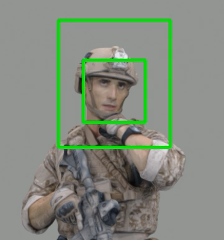
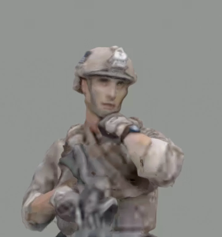
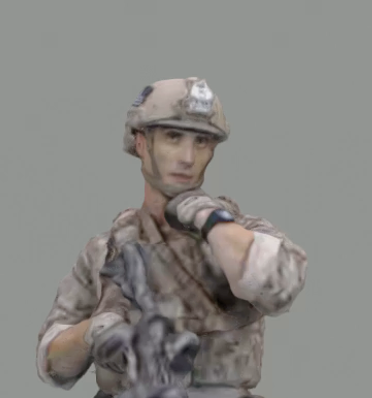
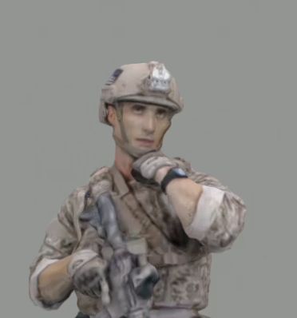
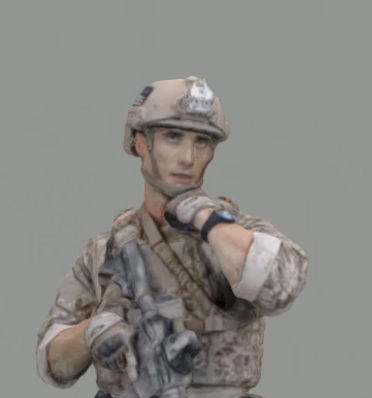

## Perceptual Impact of Facial Quality in MPEG-V-PCC-encoded Volumetric Videos


<div align="center">
  
  
  
  
  
</div>


We investigate the influence of rendering face quality of the avatars on users' viewing experience in MPEG V-PCC-encoded volumetric videos.  We conducted a subjective quality assessment study using the Degradation Category Rating (DCR) method, manipulating facial quality by controlling the compression level of V-PCC. Our analysis reveals the significant role of facial quality in influencing users' overall perceptual quality in volumetric videos.

We collected our volumetric video quality assessment dataset and make it public. Our dataset consisting 1152 ratings from 36 users on 32 video sequences. The volumetric video sequences are encoded with MPEG V-PCC using 4 different avatar models and 6 varying qualities. The volumetric video sequences are then rendered into test videos with different quality variations in face area and body center area. The user ratings are collected on the test videos with different quality variations.


## Ratings

The user ratings can be found in the file `ratings.csv` in this repo.

The file contains five columns:

- User ID: P001 to P36.
- Point Cloud Model: **loot**, **redandblack**, **soldier**, and **longdress**
- Saliency: **face** and **center**.
- Quality Level: **L1**, **L2**, **L3**, and **L4**
- Rating: User rating of this video


## Test Video Sequences

The 32 test video sequences can be found in the Google Drive here: 

https://drive.google.com/drive/folders/1ZJfgCSO9Ta0m7pyqqXYJNg3pX8yjdJrX?usp=sharing

The test video sequences are derived from the [8i Voxelized Full Bodies (8iVFB v2) Point Cloud Dataset](http://plenodb.jpeg.org/pc/8ilabs/).

> - Eugene d'Eon, Bob Harrison, Taos Myers, and Philip A. Chou, "8i Voxelized Full Bodies - A Voxelized Point Cloud Dataset," ISO/IEC JTC1/SC29 Joint WG11/WG1 (MPEG/JPEG) input document WG11M40059/WG1M74006, Geneva, January 2017.


## Citation

If you use this publicly available dataset, please cite our paper in your publication.

```
@InProceedings{
    title = "Perceptual Impact of Facial Quality in MPEG V-PCC-encoded Volumetric Videos",
    author = "Yuang Shi and Wei Tsang Ooi",
    booktitle = "Proceedings of the 16th International Workshop on Immersive Mixed and Virtual Environment Systems (MMVE)",
    year = 2024,
    month = April,
    address = "Bari, Italy",
}
```